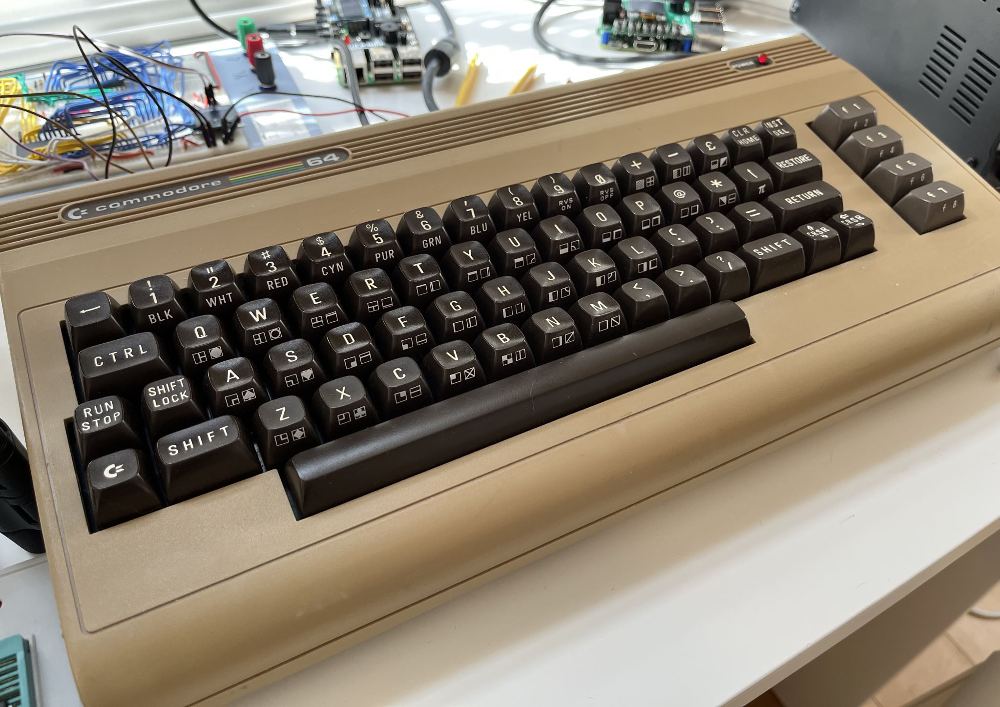
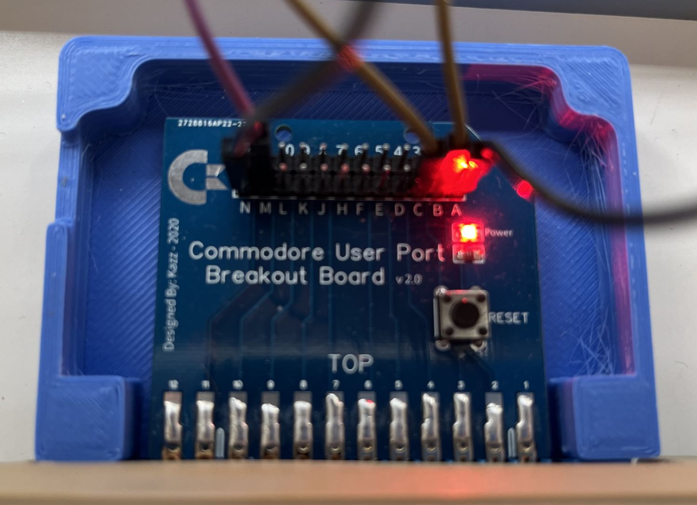

# c64eeprom

With this code and the related hardware changes, you can write assembly on the C64 using Turbo Macro Pro and send the assembled code via rs232 to an arduino-based eeprom programmer that you build yourself. The programmer then writes the bytes at the location you specify directly to the eeprom. Check out this [Youtube video](https://youtu.be/HGbG21RBjN8) if you want a full overview, including a walkthrough of the code.

Motivation: I'm building one of Ben Eater's [6502 computers](https://www.youtube.com/watch?v=LnzuMJLZRdU). I was waiting on some parts and decided to build one of his [eeprom programmers](https://github.com/beneater/eeprom-programmer). Instead of doing it stock, I decided to add some enhancements as part of my learning exercise.

The eeprom programmer was enhanced to:
1. Write to both AT28C256 and AT28C16@DIP24 chips.
1. Allow selection between the above chips, which can be on the board at the same time.
1. Disable Software Data Protection (SDP).
1. Poll the chip to detect when data was actually written rather than sleep unnecessarily long.

I wanted to be able to write assembly code using Turbo Macro Pro (TMP) on my c64 rather than using python. With the c64 code in this repo, you can:
1. Write code using TMP and assemble to disk.
1. Wire up the c64 user port to the eeprom programmer.
1. Send data over RS232 from the c64 to the eeprom programmer.
1. Check for errors in sending.

Note: I'm a noob on a lot of this stuff, so I probably did stupid things. Oh well, I'm learning.

Links and thank you's

* Thank you to [Ben Eater](https://www.youtube.com/watch?v=LnzuMJLZRdU) for his cool projects and his [eeprom programmer](https://github.com/beneater/eeprom-programmer)
* Thank you to [Retro computing](https://retrogamecoders.com/commodore-64-arduino/) for info on how to connect the c64 to the Arduino.
* Thank you to [Mike Sutton](https://bread80.com/2020/08/10/the-ben-eater-eeprom-programmer-28c256-and-software-data-protection/) for his info on how to disable Software Data Protection (SDP) on AT28C256 ICs.